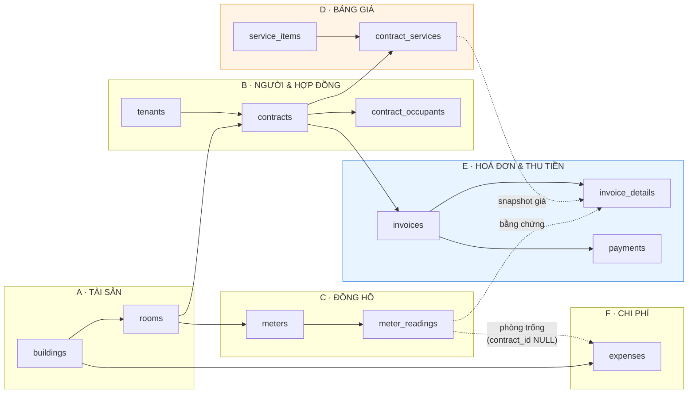
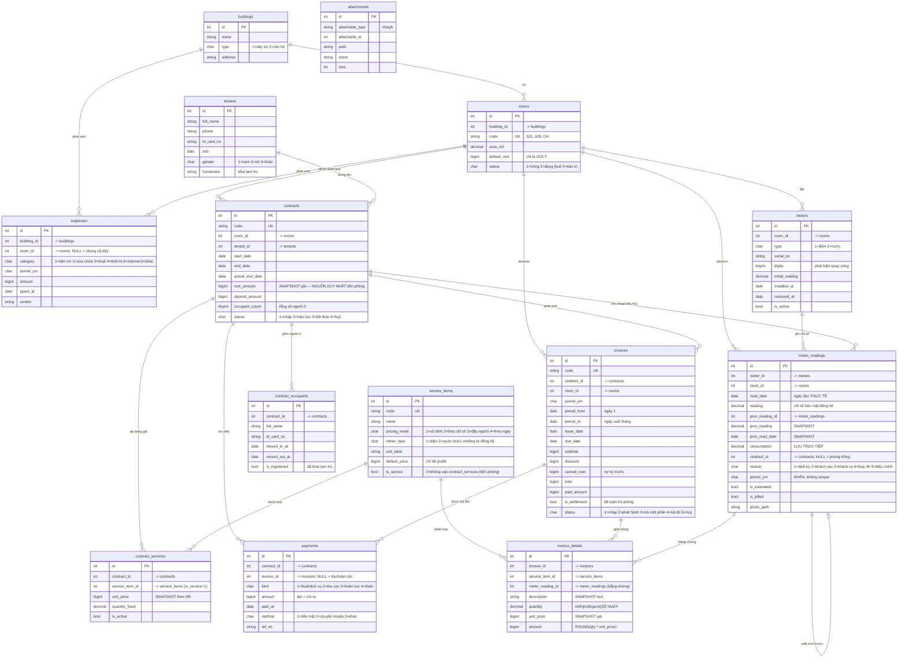
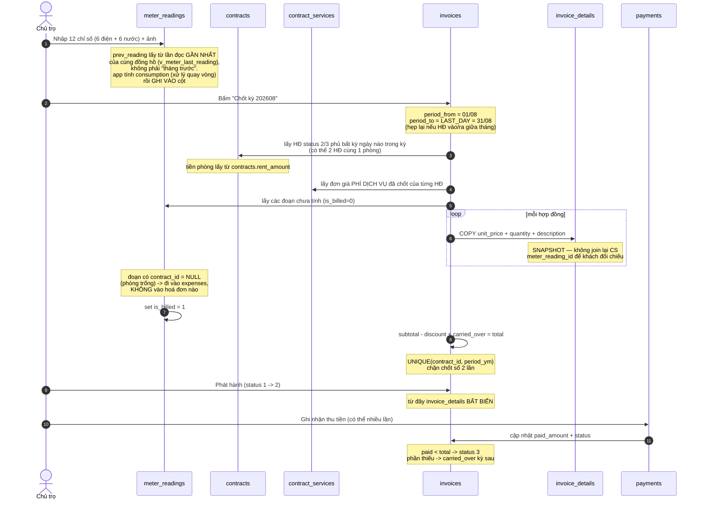
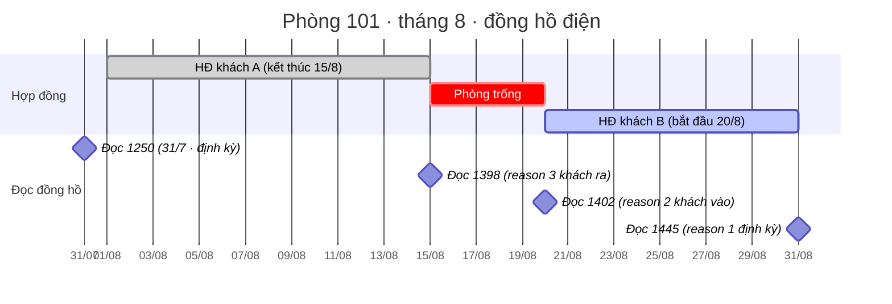
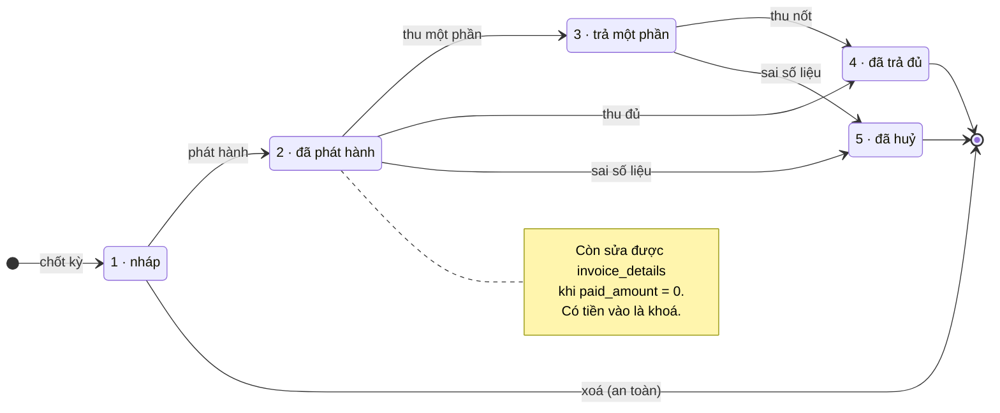

# ERD — Hệ thống Quản lý Nhà trọ

> **Phạm vi:** 1 chủ sở hữu duy nhất · 2 toà (1 dãy trọ 5 phòng + 1 căn hộ) · điện/nước theo chỉ số đồng hồ · tiền rác
> **Nguồn tham chiếu:** rút gọn từ mô hình lease-mart (bỏ owner/supplier, thêm meter readings)
> **Chu kỳ tính tiền:** tháng dương lịch, chốt sổ **ngày cuối tháng**, mọi phòng cùng lúc — trừ khi khách trả phòng và muốn tất toán ngay (xem mục 4)
> **Quy ước kỹ thuật:** phân loại dùng `CHAR(1)` mã số (bảng mã ở mục 7) · **không có FOREIGN KEY** — quan hệ do tầng app đảm bảo · soft delete bằng cột **`del_flag`** (`0`=còn, `1`=đã xoá), không dùng `deleted_at`
> **Trạng thái:** v1 — các giả định đã chốt hết

---

## 1. Bức tranh tổng thể



**Ranh giới quan trọng nhất** (đường nét đứt): nhóm **D là cấu hình — sửa được**, nhóm **E là kết quả — bất biến**. Dữ liệu chảy từ D sang E bằng cách **copy**, không tra cứu ngược lúc hiển thị.

> Mọi mũi tên trong tài liệu này là **quan hệ logic**, không phải `FOREIGN KEY`. Schema cố ý không có ràng buộc FK — tầng app tự đảm bảo. Đổi lại, phải chạy định kỳ nhóm truy vấn **KIỂM TRA TOÀN VẸN** ở cuối [`02-schema.sql`](02-schema.sql), đặc biệt truy vấn `[F]` dò bản ghi mồ côi.

---

## 2. ERD chi tiết



> `attachments` (polymorphic — gắn vào tenant / contract / meter_reading / expense / room), `settings` (key-value) và `users` không vẽ trong ERD vì không có quan hệ với các bảng nghiệp vụ.

### Bảng giá khởi tạo (`service_items`)

| `code` | Tên | `pricing_mode` | Đơn vị | Giá mặc định | `is_service` |
|---|---|---|---|---|---|
| `rent` | Tiền phòng | `1` cố định | tháng | — | **0** |
| `electric` | Tiền điện | `2` theo chỉ số | kWh | 3.500 | 1 |
| `water` | Tiền nước | `2` theo chỉ số | m³ | 15.000 | 1 |
| `garbage` | Tiền rác | `1` cố định | tháng | **20.000** | 1 |
| `internet` | Internet | `1` cố định | tháng | 0 | 1 |
| `parking` | Gửi xe | `1` cố định | xe | 0 | 1 |
| `other` | Khoản khác | `1` cố định | — | 0 | 1 |

`default_price` chỉ để **prefill** khi tạo hợp đồng. Giá thật dùng để tính tiền nằm ở `contract_services.unit_price`.

`is_service = 0` ở dòng `rent` là cách enforce quy tắc: **tiền phòng lấy từ `contracts.rent_amount`, không bao giờ nằm trong `contract_services`** — tránh hai nguồn cùng giữ một con số. Dòng `rent` vẫn tồn tại để phân loại `invoice_details`.

---

## 3. Luồng chốt sổ hàng tháng

Đây là nghiệp vụ xương sống — mọi thiết kế bảng ở trên đều phục vụ luồng này.



---

## 4. Ca khó: trả phòng giữa tháng + cho thuê lại ngay

Đây là ca duy nhất phá vỡ mô hình "mỗi đồng hồ một dòng đọc mỗi tháng". Ví dụ phòng 101, tháng 8:



Bốn dòng `meter_readings`, ba đoạn tiêu thụ, ba đích đến khác nhau:

| Đoạn | Chỉ số | kWh | `contract_id` | `reason` | Đi về đâu |
|---|---|---|---|---|---|
| 31/7 → 15/8 | 1250 → 1398 | 148 | HĐ khách A | `3` khách ra | `invoice_details` — HĐ tất toán của A (`is_settlement=1`) |
| 15/8 → 20/8 | 1398 → 1402 | 4 | **NULL** | `2` khách vào | `expenses` — phòng trống, **chủ chịu** |
| 20/8 → 31/8 | 1402 → 1445 | 43 | HĐ khách B | `1` định kỳ | `invoice_details` — hoá đơn tháng 8 của B |

Ba điều thiết kế phải cho phép, mà bản v1 ban đầu **không** cho phép:

1. **Nhiều lần đọc trong một tháng** → khoá đổi từ `UNIQUE(meter_id, period_ym)` sang `UNIQUE(meter_id, read_date)`. `period_ym` chỉ còn là nhãn nhóm báo cáo.
2. **Quy trách nhiệm cho từng đoạn** → thêm `meter_readings.contract_id`. `NULL` nghĩa là phòng trống → sinh `expenses` thay vì `invoice_details`.
3. **Hai hoá đơn cùng phòng cùng tháng** → hợp lệ vì khác `contract_id`.

> **Sửa sau khi cài đặt thực tế:** ban đầu bảng `invoices` có `UNIQUE(contract_id, period_ym)`. Nó vỡ ở ca *"đã chốt sổ rồi khách mới báo trả phòng"* — hoá đơn tháng cũ phải huỷ để dựng lại theo ngày trả thực tế, nhưng hoá đơn đã huỷ **vẫn chiếm chỗ trong unique index** nên không tạo lại được. Đã đổi thành index thường; việc chống trùng chuyển sang tầng app (`BillingService::commit` lọc hợp đồng đã có hoá đơn còn hiệu lực). Nhất quán với triết lý fake FK của schema.

Bạn **không bắt buộc phải đi đọc đúng ngày trả phòng** — nếu để tới cuối tháng mới đọc thì chỉ tạo 1 dòng `reason='3'` với `read_date = 31/8`, và đoạn phòng trống gộp luôn vào đó. Đồng hồ đứng yên nên số liệu vẫn đúng. Mô hình chuỗi-theo-ngày chấp nhận cả hai cách làm mà không cần logic riêng.

> **Đã chốt:** khi đọc gộp, vài kWh của mấy ngày phòng trống tính luôn cho khách trả phòng — không tách. Chỉ tách thành dòng `reason='3'` riêng khi phòng trống dài ngày (có chạy điều hòa dọn dẹp, sửa chữa).

### Tiền phòng khi ở lẻ tháng

Không nhân phân số (`15/31 = 0.48` → lệch tiền và khó giải thích). Quy về **đơn giá ngày, làm tròn đơn giá trước rồi mới nhân**:

```
days_in_month = DAY(LAST_DAY(period_from))
days_stayed   = DATEDIFF(period_to, period_from) + 1
unit_price    = ROUND(contracts.rent_amount / days_in_month)
quantity      = days_stayed
amount        = unit_price * days_stayed
description   = 'Tiền phòng 16/08-31/08 (16 ngày)'
```

Ở trọn tháng thì `quantity = 1`, `unit_price = rent_amount` — không quy ngày.

---

## 5. Vòng đời trạng thái

`invoices.status` — `CHAR(1)`:



---

## 6. Năm quyết định thiết kế cần nhớ

| # | Quyết định | Vì sao | Nếu làm sai thì hỏng gì |
|---|---|---|---|
| 1 | **Giá nằm ở hợp đồng, không ở phòng** | 5 phòng cùng loại hôm nay, nhưng khách mới sẽ có giá khác | Tăng giá điện → hoá đơn 6 tháng trước đổi số |
| 2 | **`meter_readings` là chuỗi theo `read_date`, không phải bảng theo tháng** | Trả phòng giữa tháng + cho thuê lại ngay → 1 đồng hồ đọc 3–4 lần/tháng | Không nhập nổi số liệu thực tế; phải sửa tay hoặc bịa ngày |
| 3 | **`prev_reading` + `consumption` lưu tường minh** | Quay vòng đồng hồ, thay đồng hồ, đọc gộp đều làm `consumption ≠ reading − prev_reading` | Tính sai tiền điện, sai số dồn qua các tháng |
| 4 | **`invoice_details` copy `unit_price` + `description`** | Hoá đơn là chứng từ, phải bất biến | Không đối chiếu được với khách, mất tin cậy |
| 5 | **Tiền phòng chỉ ở `contracts.rent_amount`** (`is_service=0`) | Hai bảng cùng giữ một con số sẽ lệch | Hoá đơn in một giá, hợp đồng ghi giá khác |

**Ba thứ đã bỏ so với lease-mart:** `owners`, `suppliers` (+ 5 slot chia tiền trên mỗi bill), `properties_room_utility_costs` (47 cột map ID người chịu chi phí). Tất cả tồn tại vì lease-mart quản lý hộ chủ nhà khác — bạn là chủ, không cần.

**Một thứ thêm mới:** `meters` + `meter_readings`. Lease-mart chỉ lưu số tiền (`tenant_amount`), không lưu chỉ số — không copy được.

---

## 7. Bảng mã `CHAR(1)`

Mọi cột phân loại dùng mã số, ý nghĩa ghi trong `COMMENT` ngay cạnh cột trong file SQL.

| Cột | Mã |
|---|---|
| `buildings.type` | `1` dãy trọ · `2` căn hộ |
| `rooms.status` | `1` trống · `2` đang thuê · `3` bảo trì |
| `tenants.gender` | `1` nam · `2` nữ · `3` khác |
| `contracts.status` | `1` nháp · `2` hiệu lực · `3` đã kết thúc · `4` đã huỷ |
| `meters.type` | `1` điện · `2` nước |
| `meter_readings.reason` | `1` định kỳ · `2` khách vào · `3` khách ra · `4` thay đồng hồ · `5` điều chỉnh |
| `service_items.pricing_mode` | `1` cố định · `2` theo chỉ số · `3` theo đầu người · `4` theo ngày |
| `service_items.meter_type` | `1` điện · `2` nước · `NULL` không từ đồng hồ |
| `invoices.status` | `1` nháp · `2` đã phát hành · `3` trả một phần · `4` đã trả đủ · `5` đã huỷ |
| `payments.kind` | `1` tiền thuê/dịch vụ · `2` thu cọc · `3` hoàn cọc · `4` khác |
| `payments.method` | `1` tiền mặt · `2` chuyển khoản · `3` khác |
| `expenses.category` | `1` hoá đơn tiện ích · `2` sửa chữa · `3` thuế · `4` thiết bị · `5` internet · `6` khác |

Các cột cờ (`is_active`, `is_billed`, `is_estimated`, `is_settlement`, `is_registered`, `is_service`) giữ nguyên `TINYINT(1)` giá trị `0`/`1`.

---

## 8. Giả định — đã chốt hết

- **Ngày chốt sổ** → cuối tháng dương lịch cho mọi phòng. Cột `contracts.billing_day` đã bỏ.
- **Chỉ số đồng hồ** → chuỗi theo ngày đọc, nhiều lần đọc/tháng, quy trách nhiệm từng đoạn (mục 4).
- **Tiền rác** → cố định 20.000đ/phòng/tháng, không theo đầu người.
- **Đoạn phòng trống** khi đọc gộp → không tách, gộp vào khách trả phòng.
- **Ở ghép** → CÓ, lưu trong `contract_occupants` để khai tạm trú và đếm đầu người. **Không trả riêng** — mọi `payments` gắn `contract_id`, không gắn occupant.
- **Tiền phòng** → `contracts.rent_amount` là nguồn duy nhất; `service_items.rent` có `is_service = 0` để chặn lọt vào `contract_services`.

---

## 9. Tài liệu liên quan

[`03-admin-flow.md`](03-admin-flow.md) — flow nghiệp vụ admin: 4 sự kiện sinh `meter_readings`, thiết kế 5 màn hình chính, bảng tra sự kiện → bản ghi.


[`02-schema.sql`](02-schema.sql) — **16 bảng + 5 view**, MySQL 8 / MariaDB 10.6+, không FK.

**Seed sẵn:** 2 toà · 6 phòng · 12 đồng hồ · 7 khoản thu · 6 dòng cấu hình.

**Views:**

| View | Dùng khi |
|---|---|
| `v_room_current_contract` | Màn hình chính — phòng nào đang có ai thuê |
| `v_meter_last_reading` | Prefill `prev_reading` khi nhập chỉ số mới |
| `v_unbilled_consumption` | Hàng chờ chốt sổ, có cột `destination` = `invoice` \| `expense` |
| `v_invoice_balance` | Công nợ từng hoá đơn |
| `v_monthly_pnl` | Lời lỗ theo tháng |

**Cuối file SQL còn 3 khối tham chiếu:**
- Quy tắc bất biến — 8 điều enforce ở tầng app, vì DB không có FK nên không tự bảo vệ
- 6 truy vấn mẫu: nhập chỉ số · quy trách nhiệm đoạn tiêu thụ · lấy HĐ cần chốt sổ · nợ chuyển kỳ · cọc còn lại
- 6 truy vấn kiểm tra toàn vẹn `[A]`–`[F]`, trong đó **`[F]` dò bản ghi mồ côi** — bắt buộc chạy định kỳ khi không dùng FK
