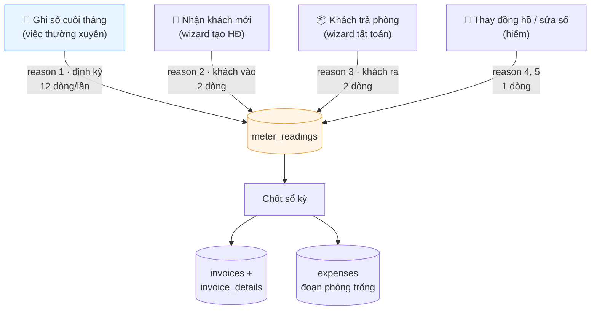
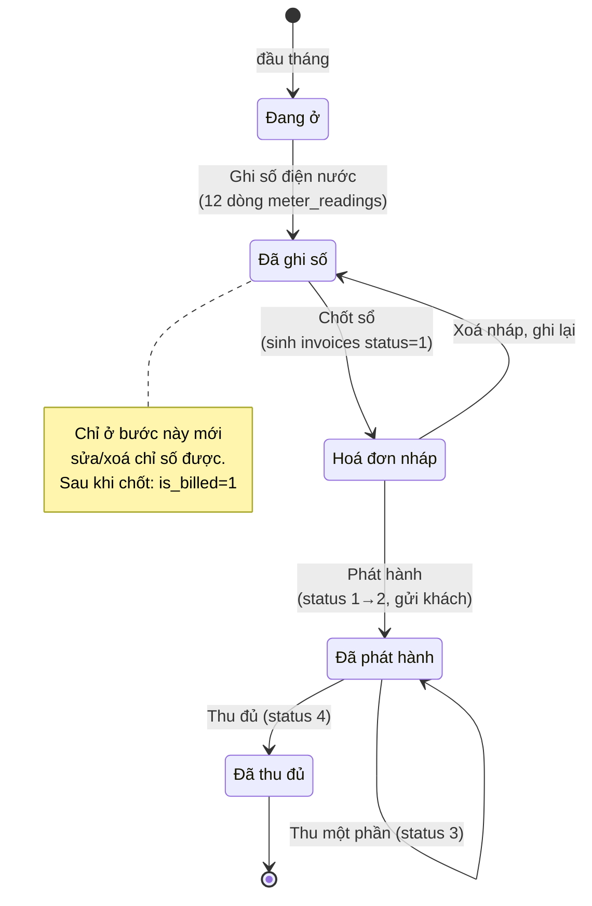
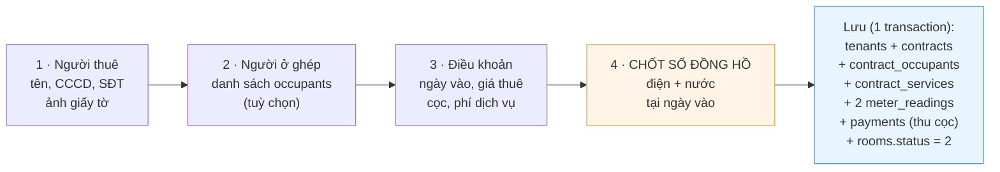

# Flow nghiệp vụ Admin

> **Bối cảnh:** 1 người dùng duy nhất (chủ trọ), 6 phòng, 12 đồng hồ. Không có phân quyền, không có nhiều người dùng đồng thời.
> **Mục tiêu thiết kế:** công việc hàng tháng gói trong **2 lần bấm** — nhập 12 con số, rồi chốt sổ.
> **Tài liệu liên quan:** [`01-erd.md`](01-erd.md) · [`02-schema.sql`](02-schema.sql)

---

## 1. Nguyên tắc gốc: `meter_readings` KHÔNG có form CRUD

Đây là quyết định UI quan trọng nhất của cả hệ thống.

Nếu làm một form "Thêm chỉ số" kiểu CRUD thông thường — dropdown chọn đồng hồ, ô nhập chỉ số, dropdown chọn hợp đồng — thì bạn đã đẩy **ba việc khó** sang cho người dùng tự làm đúng:

| Việc | Vì sao người dùng không nên tự làm |
|---|---|
| Chọn `prev_reading` | Phải tra lần đọc gần nhất của **đúng đồng hồ đó**. Chọn sai → sai số dồn mãi |
| Chọn `contract_id` | Phải biết hợp đồng nào phủ khoảng `(prev_read_date, read_date]`. Phòng vừa đổi khách là sai ngay |
| Chọn `reason` | Người dùng không nghĩ bằng từ vựng của DB |

Cả ba đều **suy ra được từ ngữ cảnh**. Nên `meter_readings` chỉ được sinh ra từ **4 sự kiện nghiệp vụ**, mỗi sự kiện là một màn hình có mục đích riêng:



**Không có đường nào khác vào `meter_readings`.** Sự kiện nào cũng tự điền `prev_reading`, `prev_read_date`, `prev_reading_id`, `consumption`, `contract_id`, `reason`, `period_ym` — người dùng chỉ nhập **chỉ số mới** và (tuỳ chọn) chụp ảnh.

---

## 2. Vòng đời một tháng



Điểm mấu chốt: **ghi số và chốt sổ là hai bước tách rời**. Ghi số xong bạn có thể xem lại, sửa, bổ sung ảnh. Chốt sổ mới là hành động sinh chứng từ.

---

## 3. Màn hình 1 — Dashboard (trang chủ)

Đây là màn hình bạn mở 90% số lần. Nó phải trả lời được 3 câu trong một cái nhìn: *tháng này đã ghi số chưa · ai đang nợ · phòng nào trống.*

```
┌──────────────────────────────────────────────────────────────────────┐
│  NHÀ TRỌ                              Kỳ 08/2026    [⚙ Cấu hình]     │
├──────────────────────────────────────────────────────────────────────┤
│  ⚠ Chưa ghi số điện nước kỳ 08/2026        [ GHI SỐ NGAY → ]         │
├──────────────────────────────────────────────────────────────────────┤
│  DÃY TRỌ                                                             │
│  ┌────────────┐ ┌────────────┐ ┌────────────┐                        │
│  │ 101        │ │ 102        │ │ 103        │                        │
│  │ Nguyễn A   │ │ Trần B     │ │  — trống — │                        │
│  │ 2.000.000đ │ │ 2.000.000đ │ │            │                        │
│  │ ✓ đã thu   │ │ ⚠ nợ 450k  │ │ [+ Cho     │                        │
│  │            │ │            │ │   thuê]    │                        │
│  └────────────┘ └────────────┘ └────────────┘                        │
│  ┌────────────┐ ┌────────────┐                                       │
│  │ 104        │ │ 105        │        ... 2 phòng nữa                 │
│  └────────────┘ └────────────┘                                       │
│                                                                      │
│  CĂN HỘ                                                              │
│  ┌────────────┐                                                      │
│  │ CH         │                                                      │
│  └────────────┘                                                      │
├──────────────────────────────────────────────────────────────────────┤
│  Tháng 08: thu 8.4tr · chi 1.2tr · lãi 7.2tr        [Xem báo cáo →]   │
└──────────────────────────────────────────────────────────────────────┘
```

**Dải cảnh báo trên cùng** là trái tim của UX. Nó thay đổi theo trạng thái kỳ:

| Trạng thái kỳ | Dải cảnh báo | Nút |
|---|---|---|
| Chưa ghi số | ⚠ Chưa ghi số điện nước kỳ này | `GHI SỐ NGAY` |
| Đã ghi, chưa chốt | ✓ Đã ghi số 31/08 · chưa chốt sổ | `CHỐT SỔ` |
| Đã chốt, chưa phát hành | 3 hoá đơn nháp chờ phát hành | `XEM & PHÁT HÀNH` |
| Đã phát hành | 2/3 hoá đơn đã thu | `XEM CÔNG NỢ` |
| **Kỳ trước chưa ghi** | 🔴 Kỳ 07/2026 chưa ghi số | `GHI BÙ` |

Dòng cuối cùng quan trọng: nếu tháng trước bạn quên, hệ thống phải **nhắc chứ không im lặng nhảy qua**. Mô hình chuỗi-theo-ngày cho phép ghi bù, nhưng chỉ khi UI chịu nói ra.

---

## 4. Màn hình 2 — Ghi số điện nước (quan trọng nhất)

Một trang, một bảng, 12 ô nhập. Không tab, không dropdown chọn phòng.

```
┌───────────────────────────────────────────────────────────────────────────────┐
│  GHI SỐ ĐIỆN NƯỚC — Kỳ 08/2026            Ngày ghi: [31/08/2026 ▾]            │
├───────────────────────────────────────────────────────────────────────────────┤
│         ┌─────── ĐIỆN ────────┐  ┌─────── NƯỚC ────────┐                      │
│ Phòng   Cũ 31/07   Mới    kWh    Cũ 31/07   Mới     m³   Tính cho      Ảnh    │
├───────────────────────────────────────────────────────────────────────────────┤
│ 101     1.250    [1398]   148     45,0    [48,2]   3,2   Nguyễn A      [📷]   │
│ 102       980    [1041]    61     32,5    [34,0]   1,5   Trần B        [📷2]  │
│ 103     1.502    [1502]     0 ⚠   28,0    [28,0]   0,0   — trống —     [ ]    │
│ 104     2.108    [    ]     —     51,0    [    ]    —    Lê C          [ ]    │
│ 105     1.877    [1901]    24     40,2    [41,0]   0,8   Phạm D        [📷]   │
│ CH      3.402    [3688]   286 ⚠  120,5   [131,2]  10,7   Hoàng E       [📷]   │
├───────────────────────────────────────────────────────────────────────────────┤
│ ⚠ 103: phòng trống, 0 kWh — bình thường                                       │
│ ⚠ CH: 286 kWh, cao gấp 2,1 lần trung bình 6 tháng (136). Kiểm tra lại?        │
│ ⚠ 104: chưa nhập                                                              │
├───────────────────────────────────────────────────────────────────────────────┤
│                                        [ Huỷ ]   [ LƯU 11/12 DÒNG ]           │
└───────────────────────────────────────────────────────────────────────────────┘
```

### Hành vi bắt buộc

**Cột "Cũ"** — chỉ đọc, lấy từ `v_meter_last_reading`, kèm ngày đọc lần trước. Người dùng không bao giờ nhập số này.

**Cột "kWh / m³"** — tính ngay khi rời ô, không chờ submit. Đây là cơ chế phát hiện lỗi nhập rẻ nhất: bạn nhìn con số tiêu thụ là biết mình bấm sai chữ số hay chưa.

**Cột "Tính cho"** — hiển thị hợp đồng mà hệ thống tự suy ra (truy vấn `[2]`). Chỉ đọc trong trường hợp thường. Nếu phòng đổi khách trong kỳ, ô này hiện **cảnh báo và link sang wizard**, không cho ghi số ở đây:

```
│ 101   1.250  [    ]    —   ...  ⚠ Phòng đổi khách 15/08 → [Dùng wizard trả phòng]
```

Lý do: khi đổi khách, một lần ghi không đủ — cần 2–3 dòng đọc với `contract_id` khác nhau. Bắt người dùng đi đúng đường thay vì cho họ nhập sai rồi sửa.

**Xác thực trước khi lưu:**

| Điều kiện | Xử lý |
|---|---|
| Số mới < số cũ | **Chặn**, trừ khi tick "Đồng hồ quay vòng" hoặc "Đã thay đồng hồ" |
| `read_date` ≤ ngày đọc trước | **Chặn** — chuỗi phải tiến về phía trước |
| Tiêu thụ = 0 mà phòng đang có người | Cảnh báo, cho qua |
| Tiêu thụ > 2× trung bình 6 kỳ | Cảnh báo, cho qua |
| Bỏ trống một số ô | Cho lưu **từng phần** — nút ghi rõ "LƯU 11/12 DÒNG" |

Cho lưu từng phần là chủ ý: bạn có thể ghi 5 phòng dãy trọ hôm nay, căn hộ mai ghi.

**Ngày ghi** — mặc định hôm nay, sửa được. Đây là `read_date`, **không phải** biên kỳ kế toán. Ghi ngày 2/9 cho kỳ 08/2026 là hợp lệ và bình thường.

### Kết quả khi bấm Lưu

Một transaction, tạo tối đa 12 dòng `meter_readings`:

```
reason        = '1'   (định kỳ)
period_ym     = '202608'
read_date     = ngày trên form
prev_*        = từ v_meter_last_reading
consumption   = app tính, có xử lý quay vòng
contract_id   = suy ra từ truy vấn [2]; NULL nếu phòng trống
is_billed     = 0
```

Sửa lại được **miễn là `is_billed = 0`**. Sau khi chốt sổ thì chỉ còn cách huỷ hoá đơn.

---

## 5. Màn hình 3 — Chốt sổ kỳ

Nút "Chốt sổ" **không được tạo hoá đơn ngay**. Nó mở trang xem trước — người dùng thấy đủ số rồi mới xác nhận.

```
┌────────────────────────────────────────────────────────────────────────┐
│  CHỐT SỔ KỲ 08/2026                              01/08 → 31/08/2026    │
├────────────────────────────────────────────────────────────────────────┤
│  Phòng 101 · Nguyễn A                                     HĐ #12       │
│    Tiền phòng           1 tháng  × 2.000.000  =  2.000.000             │
│    Tiền điện          148 kWh    ×     3.500  =    518.000             │
│    Tiền nước          3,2 m³     ×    15.000  =     48.000             │
│    Tiền rác             1 tháng  ×    20.000  =     20.000             │
│                                        ─────────────────────           │
│                                        Cộng      2.586.000             │
│                                        Nợ kỳ 07    450.000             │
│                                        TỔNG      3.036.000             │
│  ─────────────────────────────────────────────────────────────────     │
│  Phòng 102 · Trần B                                       HĐ #14       │
│    ... (thu gọn)                                 2.451.000             │
│  ─────────────────────────────────────────────────────────────────     │
│  📌 GHI VÀO CHI PHÍ (không tính cho khách)                             │
│    Phòng 103 trống · điện 0 kWh · nước 0 m³        →  0đ               │
├────────────────────────────────────────────────────────────────────────┤
│  ⚠ Phòng 104 chưa ghi số điện nước — sẽ BỎ QUA, không tạo hoá đơn      │
├────────────────────────────────────────────────────────────────────────┤
│  Tổng 5 hoá đơn · 12.480.000đ           [ Huỷ ]  [ TẠO 5 HOÁ ĐƠN NHÁP ]│
└────────────────────────────────────────────────────────────────────────┘
```

**Ba điều màn hình này phải làm đúng:**

1. **Nói rõ cái gì bị bỏ qua.** Phòng chưa ghi số thì không tạo hoá đơn — và phải hiện thành cảnh báo, không im lặng. Im lặng bỏ qua là cách nhanh nhất để một phòng bị quên thu cả tháng.

2. **Tách riêng phần vào `expenses`.** Đoạn tiêu thụ phòng trống không thuộc hoá đơn nào; hiển thị riêng để người dùng thấy nó không bị mất.

3. **Idempotent.** Chốt lần hai chỉ tạo cho hợp đồng chưa có hoá đơn còn hiệu lực ở kỳ đó (truy vấn `[3]` đã lọc `NOT EXISTS`). Bấm hai lần không sinh hoá đơn kép.

### Chốt lẻ từng phòng

Mỗi thẻ phòng có nút riêng **`Tạo hoá đơn nháp phòng 101`**, khối chi phí có nút **`Ghi vào chi phí`**, và footer vẫn giữ nút **`TẠO TẤT CẢ`**.

Lý do cần chốt lẻ: một phòng có vấn đề (chưa ghi số, số liệu nghi ngờ, đang chờ khách xác nhận) không được chặn ba phòng còn lại. Chốt lẻ xong **ở lại trang** để làm tiếp; phòng vừa chốt biến mất khỏi danh sách xem trước — đó chính là phản hồi cho biết nó đã xong. Chốt tất cả thì chuyển sang danh sách hoá đơn.

API: `POST /billing/commit` nhận thêm `contract_ids` và `expense_room_ids`. Bỏ trống cả hai = chốt cả kỳ. Chốt lẻ **không** dọn các đoạn tiêu thụ 0 của phòng khác — việc đó chỉ chạy khi chốt cả kỳ.

**Transaction:** tạo `invoices` (status `1`) + `invoice_details` + `expenses` (nếu có) + set `meter_readings.is_billed = 1`. Tất cả hoặc không gì cả.

Sau đó bạn xem lại từng hoá đơn, sửa `discount`/`note` nếu cần, rồi **Phát hành** (status `1` → `2`) — bấm được ngay trên dòng ở danh sách hoá đơn, hoặc hàng loạt bằng nút `Phát hành N nháp`.

Thu tiền và phát hành đều nằm **ngay trên dòng** của danh sách hoá đơn. Đây là hai thao tác lặp lại nhiều nhất hàng tháng; bắt vào trang chi tiết mới làm được là thêm hai cú bấm mỗi phòng, mỗi tháng.

### Sửa hoá đơn sau khi phát hành

Ranh giới bất biến **không phải** ở lúc phát hành, mà ở lúc **có tiền vào**:

| Trạng thái | Sửa chi tiết được? |
|---|---|
| Nháp (`1`) | ✅ |
| Đã phát hành (`2`), `paid_amount = 0` | ✅ — chưa có tiền nào để bảo vệ |
| Trả một phần (`3`) hoặc đã trả đủ (`4`) | ❌ — xoá giao dịch thu tiền trước, hoặc huỷ + điều chỉnh |
| Đã huỷ (`5`) | ❌ |

Ca thường gặp: phát hành xong mới phát hiện đọc nhầm chỉ số, khách chưa trả đồng nào. Bắt huỷ hoá đơn rồi chốt lại là quá tay — mất mã hoá đơn và sinh một bản ghi huỷ vô ích.

**Rủi ro của việc cho sửa trực tiếp** là `invoice_details` và `meter_readings` kể hai câu chuyện khác nhau. Nên khi sửa số lượng của một dòng điện/nước, backend **ghi ngược về sổ đồng hồ**:

```
sửa 150 → 132 kWh trên hoá đơn
    ↓
meter_readings.consumption = 132
meter_readings.reading     = prev_reading + 132   ← chuỗi vẫn liền mạch
invoice_details.description viết lại "1.600 → 1.732 (132 kWh)"
```

Viết lại `description` là bắt buộc: nó là snapshot text, không tự tính lại lúc render — quên là hoá đơn ghi "150 kWh" trong khi số lượng đã là 132.

**Giới hạn:** chỉ đồng bộ được khi dòng hoá đơn ứng với **đúng một** lần đọc. Dòng gộp nhiều lần đọc (tháng quên ghi bị dồn) thì backend không đoán bừa — nó sửa hoá đơn nhưng trả về danh sách `unsynced` và UI báo bạn phải sửa ở màn hình Ghi số.

---

## 6. Màn hình 4 — Wizard nhận khách mới

Đây là chỗ sinh `meter_readings` với `reason = '2'`. Bốn bước, một transaction ở bước cuối.



**Bước 3 — Điều khoản.** Form prefill từ `rooms.default_rent` và `service_items.default_price`. Chỉ hiện các khoản có `is_service = 1`; **tiền phòng là ô riêng** phía trên, không nằm trong danh sách phí dịch vụ (vì nó lưu ở `contracts.rent_amount`).

```
│  Tiền phòng / tháng    [ 2.000.000 ]     ← contracts.rent_amount
│  Tiền cọc              [ 2.000.000 ]     ← contracts.deposit_amount
│  Ngày vào              [ 20/08/2026 ]
│  ─────────────────────────────────────
│  PHÍ DỊCH VỤ                             ← contract_services
│  ☑ Tiền điện     [  3.500 ] / kWh
│  ☑ Tiền nước     [ 15.000 ] / m³
│  ☑ Tiền rác      [ 20.000 ] / tháng
│  ☐ Internet      [      0 ] / tháng
│  ☑ Gửi xe        [ 50.000 ] × [ 2 ] xe
```

**Bước 4 — Chốt số đồng hồ. Không được cho bỏ qua.** Đây là điểm khởi đầu chuỗi đọc của khách mới; thiếu nó thì hoá đơn đầu tiên sẽ tính cả phần điện của khách trước.

```
│  Số đồng hồ tại ngày vào 20/08/2026
│  Điện:  số cũ 1.398 (đọc 15/08)   →  [ 1402 ]   = 4 kWh
│  Nước:  số cũ  48,2 (đọc 15/08)   →  [ 48,4 ]   = 0,2 m³
│
│  ℹ 4 kWh và 0,2 m³ này thuộc khoảng phòng trống 15/08→20/08
│    → ghi vào CHI PHÍ của bạn, không tính cho khách mới
```

Dòng ghi chú cuối là thứ giúp người dùng tin hệ thống: nó nói rõ đoạn tiêu thụ đi đâu, thay vì lặng lẽ tạo `contract_id = NULL`.

---

## 7. Màn hình 5 — Wizard khách trả phòng

Sinh `meter_readings` với `reason = '3'`, và là màn hình duy nhất tạo hoá đơn `is_settlement = 1`.

```
┌──────────────────────────────────────────────────────────────────┐
│  TRẢ PHÒNG — 101 · Nguyễn A · HĐ #12                             │
├──────────────────────────────────────────────────────────────────┤
│  1. Ngày trả phòng    [ 15/08/2026 ]                             │
│                                                                  │
│  2. Chốt số đồng hồ tại ngày trả                                 │
│     Điện  1.250 (31/07)  → [ 1398 ]  = 148 kWh                   │
│     Nước   45,0 (31/07)  → [ 48,2 ]  = 3,2 m³                    │
│                                                                  │
│  3. Hoá đơn tất toán 01/08 → 15/08 (15 ngày)                     │
│     Tiền phòng    15 ngày × 64.516      =   967.740              │
│                   (2.000.000 / 31 ngày)                          │
│     Tiền điện    148 kWh  ×  3.500      =   518.000              │
│     Tiền nước    3,2 m³   × 15.000      =    48.000              │
│     Tiền rác      1 tháng × 20.000      =    20.000  [sửa]       │
│     Nợ kỳ trước                         =   450.000              │
│                                          ───────────             │
│                                  TỔNG PHẢI THU  2.003.740        │
│                                                                  │
│  4. Xử lý cọc          Cọc đã nhận  2.000.000                    │
│     ☐ Trừ hỏng hóc  [        0 ]  Lý do [                 ]      │
│     ☑ Hoàn lại cho khách          2.000.000                      │
│                                                                  │
│     → Khách phải trả thêm:  3.740đ                               │
├──────────────────────────────────────────────────────────────────┤
│                          [ Huỷ ]   [ TẤT TOÁN & TRẢ PHÒNG ]      │
└──────────────────────────────────────────────────────────────────┘
```

Chú ý mục 3: **tiền rác 20.000đ nguyên tháng dù chỉ ở 15 ngày** — vì `pricing_mode = '1'` (cố định). Đây là hành vi đúng theo cấu hình, nhưng phải cho nút `[sửa]` để bạn giảm xuống nếu muốn. Đừng để hệ thống ép một quyết định mà bạn có thể muốn linh động.

**Transaction khi bấm Tất toán:**

```
1. meter_readings   × 2   reason='3', contract_id = HĐ #12
2. invoices         × 1   is_settlement=1, period_to=15/08, status=1
3. invoice_details  × 4
4. contracts              actual_end_date=15/08, status='3'
5. rooms                  status='1' (trống)
6. payments               kind='3' (hoàn cọc), amount = -2.000.000
```

Sau đó phòng 101 hiện trên dashboard là trống, có nút `[+ Cho thuê]` — nếu có khách mới trong cùng tháng thì đi wizard mục 6, và hệ thống tự xử lý đoạn phòng trống.

---

## 8. Các màn hình còn lại (đơn giản, CRUD thường)

| Màn hình | Ghi chú |
|---|---|
| **Thu tiền** | Ba đường vào: nút `Thu tiền` **ngay trên từng dòng** danh sách hoá đơn · nút trong trang chi tiết · nút `Thu nợ` trên thẻ phòng ở Dashboard (dẫn tới danh sách đã lọc theo phòng). Form prefill số còn nợ; thu nhiều lần được, `status` tự chuyển `3`/`4` |
| **Chi phí** | Form thường: loại, số tiền, ngày, nhà cung cấp, ảnh hoá đơn. Nhập hoá đơn EVN/nước tổng ở đây để đối chiếu với tiền thu từ khách |
| **Danh mục khoản thu** | Sửa `service_items`. Đổi `default_price` **không** ảnh hưởng hợp đồng đang chạy — phải nói rõ điều này trên form |
| **Tăng giá hợp đồng đang chạy** | Sửa `contract_services.unit_price` (hoặc `contracts.rent_amount`). Cảnh báo: chỉ áp dụng từ kỳ chưa chốt |
| **Thay đồng hồ** | `meters.removed_at` + tạo `meters` mới + 1 `meter_readings` `reason='4'`. Hiếm, để trong trang chi tiết phòng |
| **Báo cáo** | `v_monthly_pnl` — bảng 12 tháng, thu/chi/lãi. Thêm biểu đồ cột nếu muốn |
| **Cấu hình** | `settings` — tên chủ trọ, số tài khoản, ghi chú hoá đơn, số ngày tới hạn |

---

## 9. Bảng tra: sự kiện → bản ghi sinh ra

| Sự kiện admin | `meter_readings` | `invoices` | `payments` | Bảng khác |
|---|---|---|---|---|
| Ghi số cuối tháng | 12 dòng `reason=1` | — | — | — |
| Chốt sổ kỳ | `is_billed=1` | N dòng status `1` | — | `expenses` (nếu có phòng trống) |
| Phát hành | — | status `1`→`2` | — | — |
| Thu tiền | — | `paid_amount`, status `3`/`4` | 1 dòng `kind=1` | — |
| Nhận khách mới | 2 dòng `reason=2` | — | 1 dòng `kind=2` (thu cọc) | `tenants`, `contracts`, `contract_occupants`, `contract_services`, `rooms.status=2` |
| Khách trả phòng | 2 dòng `reason=3` | 1 dòng `is_settlement=1` | 1 dòng `kind=3` (hoàn cọc) | `contracts.status=3`, `rooms.status=1` |
| Thay đồng hồ | 1 dòng `reason=4` | — | — | `meters` (cũ `removed_at`, mới) |
| Sửa số nhập sai (chưa chốt) | UPDATE dòng cũ | — | — | — |
| Sửa số nhập sai (đã chốt) | 1 dòng `reason=5` | huỷ `status=5` + phát hành lại | — | — |

---

## 10. Xác nhận và validate

### Nguyên tắc: hỏi ít nhưng hỏi đúng chỗ

Hỏi mọi nút bấm thì người dùng bấm *Đồng ý* theo phản xạ và cảnh báo mất tác dụng. Chỉ hỏi khi thao tác **khó lùi lại** hoặc **ảnh hưởng ra ngoài phạm vi người dùng đang nhìn**.

| Thao tác | Có hỏi? | Hộp thoại nói gì |
|---|---|---|
| Lưu chỉ số điện nước | Chỉ khi có cảnh báo | Liệt kê từng cảnh báo bất thường |
| Bỏ các số vừa nhập | ✅ | Số ô sẽ mất |
| Chốt sổ một phòng | ✅ | Tiền, kỳ, các phòng khác không bị ảnh hưởng |
| Chốt sổ cả kỳ | ✅ | Số hoá đơn, tổng tiền, kèm cảnh báo tồn đọng |
| Ghi đoạn phòng trống vào chi phí | ✅ | Liệt kê từng dòng, tổng tiền |
| Phát hành hoá đơn | ✅ | Vẫn sửa được tới khi thu tiền lần đầu |
| Phát hành hàng loạt | ✅ | Liệt kê từng phòng và số tiền |
| Lưu sửa hoá đơn | ✅ | Tổng cũ → tổng mới, và chỉ số nào bị ghi ngược |
| Xoá nháp / huỷ hoá đơn | ✅ | Chỉ số về hàng chờ, mã hoá đơn mới khi chốt lại |
| Xoá giao dịch thu tiền | ✅ | Công nợ tăng lại; không dùng để hoàn tiền |
| Thu quá số nợ | ✅ | Số dư, vẫn cho lưu nếu khách trả trước |
| Tạo hợp đồng | ✅ | Tóm tắt giá, cọc, số đồng hồ chốt |
| Tất toán trả phòng | ✅ | 5 hệ quả, tone đỏ vì khó lùi nhất |
| Xoá chi phí | ✅ | Báo cáo lời lỗ sẽ đổi |
| Đổi giá mặc định khoản thu | ✅ | **Chỉ** áp cho HĐ mới, khách cũ giữ giá đã ký |
| Lưu cấu hình | ❌ | Sửa lại được ngay, không sinh chứng từ |

### Validate hai lớp

**Client** ([`lib/validate.js`](../frontend/src/lib/validate.js)) cho phản hồi tức thì: viền đỏ + dòng lỗi dưới ô. Không phải là luật, chỉ là phản hồi nhanh.

Màn hình Ghi số phân biệt rõ **lỗi** và **cảnh báo**:

| | Ví dụ | Hành vi |
|---|---|---|
| **Lỗi** (đỏ) | không phải số · số âm · đã chốt sổ | Chặn, nút Lưu bị vô hiệu |
| **Cảnh báo** (vàng) | tiêu thụ 0 dù có người · cao gấp 2 lần trung bình · số mới nhỏ hơn số cũ | Cho lưu nhưng hỏi lại, liệt kê từng cái |

Wizard nhận khách validate **theo từng bước**, chặn ngay tại bước sai. Bấm Hoàn tất sẽ chạy lại cả 4 bước và nhảy về bước còn thiếu — vì người dùng có thể quay lại sửa rồi tiến lên.

**Server** — luật thật. Ba guard đáng chú ý, tồn tại vì FE có thể bị bỏ qua (import, gọi API trực tiếp):

1. **Gõ thiếu chữ số.** Nhập `160` khi số cũ là `1.600` sẽ bị hiểu là đồng hồ quay vòng → tiêu thụ `98.560 kWh`. Backend chặn khi tiêu thụ suy ra lớn hơn **10 lần** trung bình, kèm thông báo nêu rõ con số, và chỉ cho qua nếu khai báo *đã thay đồng hồ*.
2. **Trừ cọc vượt số đang giữ** — `max` động theo `depositHeld()`.
3. **Trừ cọc phải có lý do** — dùng `Rule::requiredIf(deposit_deduction > 0)`, không dùng `required_with` vì nó kích hoạt cả khi truyền `0`.

---

## 11. Ba việc dễ làm sai

**1. Cho sửa `meter_readings` sau khi đã chốt sổ.** Phải chặn bằng `is_billed`. Muốn sửa thì huỷ hoá đơn trước — có vẻ rườm rà nhưng đó chính là thứ giữ cho con số trên giấy đưa khách khớp với con số trong DB.

**2. Gộp "ghi số" và "chốt sổ" thành một nút.** Tiết kiệm một cú bấm, đổi lại mất khả năng xem trước. Với tiền thật thì đây là đánh đổi sai chiều.

**3. Để người dùng chọn `contract_id` khi ghi số.** Đúng 11/12 lần, và lần thứ 12 (phòng đổi khách giữa tháng) sai âm thầm. Hệ thống tự suy ra, và khi không suy được thì **từ chối và chỉ sang wizard** — chứ không đoán bừa.
